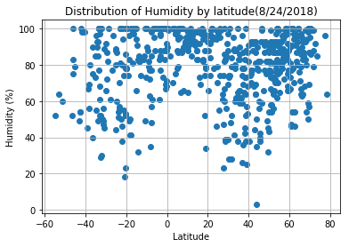
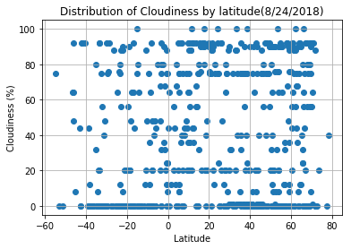

```python
# Dependencies and Setup
import matplotlib.pyplot as plt
import pandas as pd
import numpy as np
import requests
import time
import json

# Import API key
import api_keys

# Incorporated citipy to determine city based on latitude and longitude
from citipy import citipy

# Output File (CSV)
output_data_file = "output_data/cities.csv"

# Range of latitudes and longitudes
lat_range = (-90, 90)
lng_range = (-180, 180)
```

Generate Cities List


```python
# List for holding lat_lngs and cities
lat_lngs = []
cities = []

# Create a set of random lat and lng combinations
lats = np.random.uniform(low=-90.000, high=90.000, size=1500)
lngs = np.random.uniform(low=-180.000, high=180.000, size=1500)
lat_lngs = zip(lats, lngs)

# Identify nearest city for each lat, lng combination
for lat_lng in lat_lngs:
    city = citipy.nearest_city(lat_lng[0], lat_lng[1]).city_name
    
    # If the city is unique, then add it to a our cities list
    if city not in cities:
        cities.append(city)

# Print the city count to confirm sufficient count
len(cities)
```


    624


Making API Calls


```python
api_key = api_keys.api_key

# Starting URL for Weather Map API Call

url = "http://api.openweathermap.org/data/2.5/weather?"
lat = []
temp = []
humidity = []
cloudiness = []
wind_speed = []
y = []

for x in cities:
    try:
        params = {"appid" : api_key, "q" : x, "units" : "imperial"}
        response = requests.get(url, params= params).json()
        #print(response)
        lat_value = response['coord']['lat']
        temp_value = response['main']['temp']
        humidity_value = response['main']['humidity']
        cloudiness_value = response["clouds"]["all"]
        wind_speed_value = response['wind']['speed']
        lat.append(response['coord']['lat'])
        temp.append(response['main']['temp'])
        humidity.append(response['main']['humidity'])
        cloudiness.append(response["clouds"]["all"])
        wind_speed.append(response['wind']['speed'])
        y.append(x)
        print(f" For {x} The latitude is {lat_value} Temperature is {temp_value}  Humidity(%) is {humidity_value} Cloudiness(%) is {cloudiness_value} Wind Speed is {wind_speed_value}")
        
    except (KeyError, IndexError):
        print("City not found... skipping.")
        
```

     For barrow The latitude is -38.31 Temperature is 42.47  Humidity(%) is 69 Cloudiness(%) is 0 Wind Speed is 10.54
     For santa rosa The latitude is -36.62 Temperature is 44.18  Humidity(%) is 40 Cloudiness(%) is 0 Wind Speed is 6.17
     For lasa The latitude is 34.92 Temperature is 74.41  Humidity(%) is 83 Cloudiness(%) is 8 Wind Speed is 6.93
     For isangel The latitude is -19.55 Temperature is 72.35  Humidity(%) is 100 Cloudiness(%) is 56 Wind Speed is 18.48
     For bredasdorp The latitude is -34.53 Temperature is 37.4  Humidity(%) is 93 Cloudiness(%) is 0 Wind Speed is 2.24
     For punta arenas The latitude is -53.16 Temperature is 39.2  Humidity(%) is 64 Cloudiness(%) is 0 Wind Speed is 11.41
     For bay city The latitude is 43.59 Temperature is 68.14  Humidity(%) is 64 Cloudiness(%) is 90 Wind Speed is 4.7
     For banyumas The latitude is -7.52 Temperature is 78.6  Humidity(%) is 85 Cloudiness(%) is 0 Wind Speed is 10.2
     For ancud The latitude is -41.87 Temperature is 43.55  Humidity(%) is 98 Cloudiness(%) is 92 Wind Speed is 10.76
    City not found... skipping.
     For hithadhoo The latitude is -0.6 Temperature is 81.98  Humidity(%) is 100 Cloudiness(%) is 24 Wind Speed is 3.71
     For uinskoye The latitude is 56.88 Temperature is 49.44  Humidity(%) is 94 Cloudiness(%) is 32 Wind Speed is 6.96
     For faanui The latitude is -16.48 Temperature is 79.82  Humidity(%) is 100 Cloudiness(%) is 44 Wind Speed is 9.19
     For san patricio The latitude is -26.98 Temperature is 56.06  Humidity(%) is 77 Cloudiness(%) is 0 Wind Speed is 9.42
     For san angelo The latitude is 31.46 Temperature is 93.92  Humidity(%) is 28 Cloudiness(%) is 1 Wind Speed is 10.29
     For hermanus The latitude is -34.42 Temperature is 40.58  Humidity(%) is 90 Cloudiness(%) is 8 Wind Speed is 3.15
     For ilulissat The latitude is 69.22 Temperature is 51.8  Humidity(%) is 50 Cloudiness(%) is 56 Wind Speed is 23.04
     For lorengau The latitude is -2.02 Temperature is 82.52  Humidity(%) is 100 Cloudiness(%) is 36 Wind Speed is 5.5
     For port elizabeth The latitude is 39.31 Temperature is 70.29  Humidity(%) is 87 Cloudiness(%) is 1 Wind Speed is 8.63
    City not found... skipping.
     For rikitea The latitude is -23.12 Temperature is 69.83  Humidity(%) is 100 Cloudiness(%) is 56 Wind Speed is 12.1
     For hilo The latitude is 19.71 Temperature is 77  Humidity(%) is 96 Cloudiness(%) is 90 Wind Speed is 16.11
     For kapaa The latitude is 22.08 Temperature is 82.47  Humidity(%) is 100 Cloudiness(%) is 90 Wind Speed is 21.92
     For tuktoyaktuk The latitude is 69.44 Temperature is 50  Humidity(%) is 57 Cloudiness(%) is 75 Wind Speed is 4.7
     For kodiak The latitude is 39.95 Temperature is 82.94  Humidity(%) is 82 Cloudiness(%) is 20 Wind Speed is 3.36
     For puerto ayora The latitude is -0.74 Temperature is 73.4  Humidity(%) is 69 Cloudiness(%) is 75 Wind Speed is 14.99
     For albany The latitude is 42.65 Temperature is 68.81  Humidity(%) is 68 Cloudiness(%) is 20 Wind Speed is 3.36
     For cape town The latitude is -33.93 Temperature is 46.4  Humidity(%) is 93 Cloudiness(%) is 20 Wind Speed is 4.7
     For kavieng The latitude is -2.57 Temperature is 80.72  Humidity(%) is 100 Cloudiness(%) is 80 Wind Speed is 3.04
     For lata The latitude is 30.78 Temperature is 57.14  Humidity(%) is 100 Cloudiness(%) is 32 Wind Speed is 1.48
    City not found... skipping.
     For busselton The latitude is -33.64 Temperature is 53.81  Humidity(%) is 100 Cloudiness(%) is 20 Wind Speed is 5.95
     For mahebourg The latitude is -20.41 Temperature is 71.6  Humidity(%) is 78 Cloudiness(%) is 20 Wind Speed is 14.99
    City not found... skipping.
     For venado tuerto The latitude is -33.75 Temperature is 48.5  Humidity(%) is 49 Cloudiness(%) is 0 Wind Speed is 9.19
     For bluff The latitude is -23.58 Temperature is 66.23  Humidity(%) is 57 Cloudiness(%) is 80 Wind Speed is 4.38
     For taltal The latitude is -25.41 Temperature is 49.53  Humidity(%) is 89 Cloudiness(%) is 0 Wind Speed is 2.15
     For palin The latitude is 46.5 Temperature is 62.94  Humidity(%) is 99 Cloudiness(%) is 56 Wind Speed is 7.96
    City not found... skipping.
     For tuatapere The latitude is -46.13 Temperature is 46.52  Humidity(%) is 100 Cloudiness(%) is 48 Wind Speed is 13.56
     For saint-philippe The latitude is 45.36 Temperature is 72  Humidity(%) is 56 Cloudiness(%) is 1 Wind Speed is 8.05
     For nanortalik The latitude is 60.14 Temperature is 40.76  Humidity(%) is 100 Cloudiness(%) is 76 Wind Speed is 39.64
     For saskylakh The latitude is 71.97 Temperature is 47.87  Humidity(%) is 88 Cloudiness(%) is 0 Wind Speed is 4.5
     For mar del plata The latitude is -46.43 Temperature is 46.61  Humidity(%) is 52 Cloudiness(%) is 64 Wind Speed is 16.24
    City not found... skipping.
     For katra The latitude is 32.99 Temperature is 71.67  Humidity(%) is 89 Cloudiness(%) is 88 Wind Speed is 0.47
    City not found... skipping.
     For pisco The latitude is -13.71 Temperature is 60.8  Humidity(%) is 82 Cloudiness(%) is 0 Wind Speed is 13.87
     For saldanha The latitude is 41.42 Temperature is 57.95  Humidity(%) is 70 Cloudiness(%) is 8 Wind Speed is 3.04
     For dikson The latitude is 73.51 Temperature is 51.2  Humidity(%) is 85 Cloudiness(%) is 20 Wind Speed is 11.65
     For carnarvon The latitude is -30.97 Temperature is 32.3  Humidity(%) is 45 Cloudiness(%) is 0 Wind Speed is 6.73
     For jamestown The latitude is -33.21 Temperature is 51.38  Humidity(%) is 61 Cloudiness(%) is 0 Wind Speed is 6.06
     For olinda The latitude is -2.03 Temperature is 75.2  Humidity(%) is 73 Cloudiness(%) is 90 Wind Speed is 12.75
     For muros The latitude is 42.77 Temperature is 55.4  Humidity(%) is 93 Cloudiness(%) is 20 Wind Speed is 6.93
     For thompson The latitude is 55.74 Temperature is 50  Humidity(%) is 81 Cloudiness(%) is 90 Wind Speed is 2.24
     For moose factory The latitude is 51.26 Temperature is 51.8  Humidity(%) is 93 Cloudiness(%) is 90 Wind Speed is 3.36
    City not found... skipping.
     For acajutla The latitude is 13.59 Temperature is 75.36  Humidity(%) is 93 Cloudiness(%) is 56 Wind Speed is 3.38
     For pratapgarh The latitude is 25.92 Temperature is 77.97  Humidity(%) is 100 Cloudiness(%) is 92 Wind Speed is 7.07
     For mataura The latitude is -46.19 Temperature is 46.25  Humidity(%) is 83 Cloudiness(%) is 92 Wind Speed is 13.56
     For guhagar The latitude is 17.48 Temperature is 78.06  Humidity(%) is 99 Cloudiness(%) is 100 Wind Speed is 14.45
     For nelson bay The latitude is -32.72 Temperature is 68  Humidity(%) is 52 Cloudiness(%) is 75 Wind Speed is 9.17
     For kilindoni The latitude is -7.91 Temperature is 77.66  Humidity(%) is 98 Cloudiness(%) is 48 Wind Speed is 15.12
     For atuona The latitude is -9.8 Temperature is 78.83  Humidity(%) is 100 Cloudiness(%) is 0 Wind Speed is 14.67
     For magadan The latitude is 59.56 Temperature is 64.4  Humidity(%) is 88 Cloudiness(%) is 90 Wind Speed is 4.47
     For chavakachcheri The latitude is 9.66 Temperature is 82.65  Humidity(%) is 94 Cloudiness(%) is 36 Wind Speed is 9.64
     For luau The latitude is -10.7 Temperature is 66.68  Humidity(%) is 49 Cloudiness(%) is 20 Wind Speed is 3.94
     For aksarka The latitude is 66.56 Temperature is 59.16  Humidity(%) is 83 Cloudiness(%) is 44 Wind Speed is 4.61
     For geraldton The latitude is 49.72 Temperature is 64.4  Humidity(%) is 82 Cloudiness(%) is 90 Wind Speed is 8.05
     For yellowknife The latitude is 62.45 Temperature is 53.6  Humidity(%) is 54 Cloudiness(%) is 75 Wind Speed is 5.82
    City not found... skipping.
     For pevek The latitude is 69.7 Temperature is 36.8  Humidity(%) is 100 Cloudiness(%) is 92 Wind Speed is 12.1
     For tromso The latitude is 69.65 Temperature is 50  Humidity(%) is 87 Cloudiness(%) is 90 Wind Speed is 23.04
     For sao filipe The latitude is 14.9 Temperature is 77.84  Humidity(%) is 98 Cloudiness(%) is 32 Wind Speed is 6.06
     For upernavik The latitude is 72.79 Temperature is 41.03  Humidity(%) is 92 Cloudiness(%) is 0 Wind Speed is 9.98
     For arraial do cabo The latitude is -22.97 Temperature is 74.33  Humidity(%) is 81 Cloudiness(%) is 0 Wind Speed is 24.09
     For matagami The latitude is 9.67 Temperature is 66.54  Humidity(%) is 99 Cloudiness(%) is 92 Wind Speed is 3.6
     For husavik The latitude is 50.56 Temperature is 76.04  Humidity(%) is 77 Cloudiness(%) is 0 Wind Speed is 4.5
     For mount gambier The latitude is -37.83 Temperature is 50.75  Humidity(%) is 80 Cloudiness(%) is 0 Wind Speed is 3.49
     For romanovo The latitude is 56.49 Temperature is 48.81  Humidity(%) is 78 Cloudiness(%) is 0 Wind Speed is 2.71
     For turbat The latitude is 26 Temperature is 75.45  Humidity(%) is 95 Cloudiness(%) is 92 Wind Speed is 0.02
     For cabo san lucas The latitude is 22.89 Temperature is 79.63  Humidity(%) is 78 Cloudiness(%) is 75 Wind Speed is 13.87
    City not found... skipping.
     For bambous virieux The latitude is -20.34 Temperature is 69.92  Humidity(%) is 86 Cloudiness(%) is 0 Wind Speed is 10.65
     For mahibadhoo The latitude is 3.78 Temperature is 82.47  Humidity(%) is 100 Cloudiness(%) is 12 Wind Speed is 7.74
     For bethel The latitude is 60.79 Temperature is 53.96  Humidity(%) is 77 Cloudiness(%) is 90 Wind Speed is 16.11
     For tacoronte The latitude is 28.48 Temperature is 74.21  Humidity(%) is 38 Cloudiness(%) is 0 Wind Speed is 6.93
     For saint austell The latitude is 50.34 Temperature is 56.19  Humidity(%) is 92 Cloudiness(%) is 80 Wind Speed is 9.98
     For iwanai The latitude is 42.97 Temperature is 73.47  Humidity(%) is 93 Cloudiness(%) is 92 Wind Speed is 8.52
    City not found... skipping.
     For hobart The latitude is -42.88 Temperature is 57.2  Humidity(%) is 54 Cloudiness(%) is 0 Wind Speed is 11.41
     For airai The latitude is -8.93 Temperature is 70.91  Humidity(%) is 79 Cloudiness(%) is 12 Wind Speed is 1.92
     For grindavik The latitude is 63.84 Temperature is 46.83  Humidity(%) is 93 Cloudiness(%) is 0 Wind Speed is 10.29
     For ust-barguzin The latitude is 53.41 Temperature is 56.19  Humidity(%) is 97 Cloudiness(%) is 100 Wind Speed is 5.5
     For mount isa The latitude is -20.73 Temperature is 73.4  Humidity(%) is 18 Cloudiness(%) is 0 Wind Speed is 10.29
     For fort nelson The latitude is 58.81 Temperature is 51.8  Humidity(%) is 87 Cloudiness(%) is 90 Wind Speed is 4.7
     For nioro The latitude is 13.79 Temperature is 75.36  Humidity(%) is 98 Cloudiness(%) is 0 Wind Speed is 8.19
     For moranbah The latitude is -22 Temperature is 77.97  Humidity(%) is 38 Cloudiness(%) is 0 Wind Speed is 10.09
     For castro The latitude is -42.48 Temperature is 42.56  Humidity(%) is 100 Cloudiness(%) is 92 Wind Speed is 10.76
     For barentu The latitude is 15.11 Temperature is 65.19  Humidity(%) is 98 Cloudiness(%) is 80 Wind Speed is 3.04
     For port hardy The latitude is 50.7 Temperature is 62.6  Humidity(%) is 67 Cloudiness(%) is 40 Wind Speed is 10.29
     For varna The latitude is 43.22 Temperature is 62.6  Humidity(%) is 93 Cloudiness(%) is 0 Wind Speed is 2.59
     For coquimbo The latitude is -29.95 Temperature is 55.4  Humidity(%) is 66 Cloudiness(%) is 0 Wind Speed is 3.36
     For yasnogorsk The latitude is 54.48 Temperature is 46.29  Humidity(%) is 75 Cloudiness(%) is 0 Wind Speed is 2.71
     For sikasso The latitude is 11.32 Temperature is 69.51  Humidity(%) is 99 Cloudiness(%) is 100 Wind Speed is 3.38
     For haines junction The latitude is 60.75 Temperature is 56.78  Humidity(%) is 47 Cloudiness(%) is 64 Wind Speed is 2.93
     For egvekinot The latitude is 66.32 Temperature is 50.12  Humidity(%) is 63 Cloudiness(%) is 56 Wind Speed is 2.59
     For katsuura The latitude is 33.93 Temperature is 89.6  Humidity(%) is 62 Cloudiness(%) is 40 Wind Speed is 5.82
     For banjarmasin The latitude is -3.32 Temperature is 77  Humidity(%) is 88 Cloudiness(%) is 0 Wind Speed is 3.36
     For fortuna The latitude is 38.18 Temperature is 76.1  Humidity(%) is 73 Cloudiness(%) is 0 Wind Speed is 6.93
     For ushuaia The latitude is -54.81 Temperature is 44.6  Humidity(%) is 52 Cloudiness(%) is 75 Wind Speed is 12.75
     For zeya The latitude is 53.74 Temperature is 68.03  Humidity(%) is 83 Cloudiness(%) is 20 Wind Speed is 2.37
     For arlit The latitude is 18.74 Temperature is 86.39  Humidity(%) is 34 Cloudiness(%) is 20 Wind Speed is 7.63
     For oktyabrskiy The latitude is 55.61 Temperature is 50.63  Humidity(%) is 87 Cloudiness(%) is 0 Wind Speed is 2.24
     For abong mbang The latitude is 3.98 Temperature is 68.16  Humidity(%) is 97 Cloudiness(%) is 80 Wind Speed is 2.15
    City not found... skipping.
     For georgiyevka The latitude is 52.25 Temperature is 46.92  Humidity(%) is 72 Cloudiness(%) is 0 Wind Speed is 2.71
     For hualmay The latitude is -11.1 Temperature is 60.11  Humidity(%) is 85 Cloudiness(%) is 12 Wind Speed is 5.61
     For leusden The latitude is 52.13 Temperature is 53.15  Humidity(%) is 81 Cloudiness(%) is 90 Wind Speed is 2.24
     For keti bandar The latitude is 24.14 Temperature is 79.68  Humidity(%) is 99 Cloudiness(%) is 100 Wind Speed is 22.17
     For hasaki The latitude is 35.73 Temperature is 89.6  Humidity(%) is 66 Cloudiness(%) is 75 Wind Speed is 18.34
     For dejen The latitude is 10.16 Temperature is 55.74  Humidity(%) is 95 Cloudiness(%) is 92 Wind Speed is 1.48
     For san carlos The latitude is 9.66 Temperature is 73.56  Humidity(%) is 92 Cloudiness(%) is 64 Wind Speed is 3.6
     For batagay The latitude is 67.65 Temperature is 57.09  Humidity(%) is 68 Cloudiness(%) is 0 Wind Speed is 12.66
     For port alfred The latitude is -33.59 Temperature is 66.68  Humidity(%) is 77 Cloudiness(%) is 0 Wind Speed is 19.04
     For bundaberg The latitude is -24.87 Temperature is 68.79  Humidity(%) is 87 Cloudiness(%) is 64 Wind Speed is 16.02
     For provideniya The latitude is 64.42 Temperature is 46.97  Humidity(%) is 100 Cloudiness(%) is 92 Wind Speed is 5.17
     For sinnamary The latitude is 5.38 Temperature is 81.48  Humidity(%) is 95 Cloudiness(%) is 8 Wind Speed is 14.12
     For nybro The latitude is 56.75 Temperature is 54.39  Humidity(%) is 82 Cloudiness(%) is 36 Wind Speed is 4.7
     For khatanga The latitude is 71.98 Temperature is 54.44  Humidity(%) is 79 Cloudiness(%) is 0 Wind Speed is 14
     For constitucion The latitude is 23.99 Temperature is 71.6  Humidity(%) is 46 Cloudiness(%) is 75 Wind Speed is 8.05
     For nikolskoye The latitude is 59.7 Temperature is 59  Humidity(%) is 77 Cloudiness(%) is 0 Wind Speed is 8.95
     For norman wells The latitude is 65.28 Temperature is 55.4  Humidity(%) is 71 Cloudiness(%) is 40 Wind Speed is 13.87
     For belaya gora The latitude is 68.54 Temperature is 49.94  Humidity(%) is 80 Cloudiness(%) is 0 Wind Speed is 6.96
    City not found... skipping.
     For san quintin The latitude is 17.54 Temperature is 80.6  Humidity(%) is 83 Cloudiness(%) is 90 Wind Speed is 9.17
    City not found... skipping.
     For new norfolk The latitude is -42.78 Temperature is 57.2  Humidity(%) is 54 Cloudiness(%) is 0 Wind Speed is 11.41
     For aklavik The latitude is 68.22 Temperature is 53.6  Humidity(%) is 54 Cloudiness(%) is 75 Wind Speed is 2.24
     For hradec kralove The latitude is 50.21 Temperature is 62.6  Humidity(%) is 82 Cloudiness(%) is 90 Wind Speed is 9.17
     For vyritsa The latitude is 59.41 Temperature is 59  Humidity(%) is 77 Cloudiness(%) is 0 Wind Speed is 8.95
     For chimore The latitude is -16.98 Temperature is 65.82  Humidity(%) is 98 Cloudiness(%) is 92 Wind Speed is 5.5
     For merauke The latitude is -8.49 Temperature is 85.08  Humidity(%) is 72 Cloudiness(%) is 64 Wind Speed is 9.75
     For guerrero negro The latitude is 27.97 Temperature is 79.46  Humidity(%) is 60 Cloudiness(%) is 0 Wind Speed is 15.12
     For vaini The latitude is 15.34 Temperature is 67.85  Humidity(%) is 99 Cloudiness(%) is 92 Wind Speed is 4.5
     For lompoc The latitude is 34.64 Temperature is 68.34  Humidity(%) is 65 Cloudiness(%) is 1 Wind Speed is 11.41
     For tiksi The latitude is 71.64 Temperature is 43.73  Humidity(%) is 99 Cloudiness(%) is 88 Wind Speed is 6.17
     For the pas The latitude is 53.82 Temperature is 51.8  Humidity(%) is 62 Cloudiness(%) is 90 Wind Speed is 9.17
     For sitka The latitude is 37.17 Temperature is 87.29  Humidity(%) is 69 Cloudiness(%) is 56 Wind Speed is 3.71
     For chiredzi The latitude is -21.05 Temperature is 62.58  Humidity(%) is 79 Cloudiness(%) is 0 Wind Speed is 6.06
     For ust-maya The latitude is 60.42 Temperature is 57.5  Humidity(%) is 90 Cloudiness(%) is 56 Wind Speed is 3.94
     For mayo The latitude is 63.59 Temperature is 53.6  Humidity(%) is 87 Cloudiness(%) is 90 Wind Speed is 4.7
     For asyut The latitude is 27.18 Temperature is 78.8  Humidity(%) is 61 Cloudiness(%) is 0 Wind Speed is 14.99
     For yovon The latitude is 38.32 Temperature is 66.2  Humidity(%) is 45 Cloudiness(%) is 0 Wind Speed is 2.24
     For cockburn town The latitude is 21.46 Temperature is 84.05  Humidity(%) is 96 Cloudiness(%) is 88 Wind Speed is 19.82
     For virginia beach The latitude is 36.85 Temperature is 70.81  Humidity(%) is 78 Cloudiness(%) is 1 Wind Speed is 8.08
     For qaanaaq The latitude is 77.48 Temperature is 36.26  Humidity(%) is 96 Cloudiness(%) is 0 Wind Speed is 5.5
     For meulaboh The latitude is 4.14 Temperature is 82.11  Humidity(%) is 99 Cloudiness(%) is 0 Wind Speed is 3.49
     For sao miguel do araguaia The latitude is -13.28 Temperature is 71.76  Humidity(%) is 82 Cloudiness(%) is 0 Wind Speed is 2.71
    City not found... skipping.
     For roma The latitude is 41.89 Temperature is 72.82  Humidity(%) is 88 Cloudiness(%) is 0 Wind Speed is 4.7
     For noumea The latitude is -22.28 Temperature is 73.4  Humidity(%) is 46 Cloudiness(%) is 90 Wind Speed is 14.99
    City not found... skipping.
     For miraflores The latitude is 5.2 Temperature is 44.22  Humidity(%) is 95 Cloudiness(%) is 8 Wind Speed is 1.36
     For baykit The latitude is 61.68 Temperature is 53.94  Humidity(%) is 100 Cloudiness(%) is 88 Wind Speed is 4.94
     For vestmannaeyjar The latitude is 63.44 Temperature is 47.64  Humidity(%) is 95 Cloudiness(%) is 8 Wind Speed is 7.63
     For bereda The latitude is 43.27 Temperature is 59  Humidity(%) is 87 Cloudiness(%) is 0 Wind Speed is 2.24
     For sorong The latitude is -0.86 Temperature is 77.61  Humidity(%) is 100 Cloudiness(%) is 88 Wind Speed is 7.07
     For cherskiy The latitude is 68.75 Temperature is 38.78  Humidity(%) is 94 Cloudiness(%) is 80 Wind Speed is 6.4
     For antalaha The latitude is -14.9 Temperature is 66.63  Humidity(%) is 91 Cloudiness(%) is 80 Wind Speed is 9.42
     For kiruna The latitude is 67.86 Temperature is 50  Humidity(%) is 93 Cloudiness(%) is 80 Wind Speed is 4.7
     For butaritari The latitude is 3.07 Temperature is 82.52  Humidity(%) is 100 Cloudiness(%) is 44 Wind Speed is 2.37
     For kiyevskoye The latitude is 45.04 Temperature is 68  Humidity(%) is 60 Cloudiness(%) is 0 Wind Speed is 4.47
     For ponta do sol The latitude is -20.63 Temperature is 69.2  Humidity(%) is 53 Cloudiness(%) is 20 Wind Speed is 6.4
     For nishihara The latitude is 35.74 Temperature is 92.43  Humidity(%) is 59 Cloudiness(%) is 40 Wind Speed is 9.17
     For semey The latitude is 50.41 Temperature is 63.66  Humidity(%) is 91 Cloudiness(%) is 20 Wind Speed is 5.95
     For voyvozh The latitude is 62.89 Temperature is 50.61  Humidity(%) is 91 Cloudiness(%) is 68 Wind Speed is 9.08
     For ahipara The latitude is -35.17 Temperature is 57.05  Humidity(%) is 85 Cloudiness(%) is 80 Wind Speed is 17.25
    City not found... skipping.
     For avarua The latitude is -21.21 Temperature is 82.4  Humidity(%) is 74 Cloudiness(%) is 20 Wind Speed is 8.05
     For vaitape The latitude is -16.52 Temperature is 80.4  Humidity(%) is 97 Cloudiness(%) is 0 Wind Speed is 8.52
     For praia da vitoria The latitude is 38.73 Temperature is 73.4  Humidity(%) is 88 Cloudiness(%) is 75 Wind Speed is 9.08
    City not found... skipping.
    City not found... skipping.
    City not found... skipping.
    City not found... skipping.
     For desnogorsk The latitude is 54.15 Temperature is 53.49  Humidity(%) is 70 Cloudiness(%) is 0 Wind Speed is 10.09
     For siocon The latitude is 11.03 Temperature is 84.99  Humidity(%) is 93 Cloudiness(%) is 88 Wind Speed is 7.63
     For souillac The latitude is 45.6 Temperature is 56.21  Humidity(%) is 82 Cloudiness(%) is 0 Wind Speed is 6.17
     For padang The latitude is -0.92 Temperature is 81.39  Humidity(%) is 100 Cloudiness(%) is 0 Wind Speed is 9.19
     For tiznit The latitude is 29.7 Temperature is 68.03  Humidity(%) is 97 Cloudiness(%) is 20 Wind Speed is 0.69
     For chuy The latitude is -33.69 Temperature is 50.39  Humidity(%) is 100 Cloudiness(%) is 92 Wind Speed is 25.21
     For sao joao da barra The latitude is -21.64 Temperature is 74.87  Humidity(%) is 94 Cloudiness(%) is 0 Wind Speed is 28.34
     For simbahan The latitude is 6.3 Temperature is 83.64  Humidity(%) is 100 Cloudiness(%) is 36 Wind Speed is 8.08
    City not found... skipping.
     For clinton The latitude is 30.87 Temperature is 82.22  Humidity(%) is 74 Cloudiness(%) is 1 Wind Speed is 6.96
     For pinczow The latitude is 50.52 Temperature is 62.72  Humidity(%) is 90 Cloudiness(%) is 32 Wind Speed is 4.72
     For palmer The latitude is -34.85 Temperature is 60.8  Humidity(%) is 55 Cloudiness(%) is 0 Wind Speed is 6.93
     For grand gaube The latitude is -20.01 Temperature is 71.6  Humidity(%) is 78 Cloudiness(%) is 20 Wind Speed is 14.99
     For tocopilla The latitude is -22.09 Temperature is 55.52  Humidity(%) is 100 Cloudiness(%) is 8 Wind Speed is 2.15
     For wakefield The latitude is 53.68 Temperature is 48.72  Humidity(%) is 81 Cloudiness(%) is 0 Wind Speed is 9.17
     For budogoshch The latitude is 59.29 Temperature is 61.59  Humidity(%) is 68 Cloudiness(%) is 8 Wind Speed is 9.19
     For iqaluit The latitude is 63.75 Temperature is 41  Humidity(%) is 80 Cloudiness(%) is 75 Wind Speed is 13.87
     For vao The latitude is 59.1 Temperature is 68.39  Humidity(%) is 75 Cloudiness(%) is 76 Wind Speed is 14.56
     For yumen The latitude is 40.29 Temperature is 72.93  Humidity(%) is 38 Cloudiness(%) is 0 Wind Speed is 9.98
     For hobyo The latitude is 5.35 Temperature is 73.25  Humidity(%) is 87 Cloudiness(%) is 12 Wind Speed is 19.04
    City not found... skipping.
    City not found... skipping.
     For westport The latitude is 53.8 Temperature is 52.01  Humidity(%) is 91 Cloudiness(%) is 64 Wind Speed is 9.08
     For cidreira The latitude is -30.17 Temperature is 63.62  Humidity(%) is 92 Cloudiness(%) is 92 Wind Speed is 13.56
    City not found... skipping.
     For rurrenabaque The latitude is -14.44 Temperature is 72.66  Humidity(%) is 83 Cloudiness(%) is 64 Wind Speed is 2.59
     For kaitangata The latitude is -46.28 Temperature is 47.46  Humidity(%) is 75 Cloudiness(%) is 64 Wind Speed is 19.15
     For okhotsk The latitude is 59.36 Temperature is 61.32  Humidity(%) is 97 Cloudiness(%) is 88 Wind Speed is 5.06
     For tasiilaq The latitude is 65.61 Temperature is 39.2  Humidity(%) is 86 Cloudiness(%) is 80 Wind Speed is 5.82
     For kaseda The latitude is 31.42 Temperature is 84.2  Humidity(%) is 79 Cloudiness(%) is 75 Wind Speed is 10.29
     For hokota The latitude is 36.26 Temperature is 89.6  Humidity(%) is 62 Cloudiness(%) is 75 Wind Speed is 12.75
    City not found... skipping.
     For victoria The latitude is 5.28 Temperature is 85.21  Humidity(%) is 79 Cloudiness(%) is 75 Wind Speed is 3.36
     For kaeo The latitude is -35.1 Temperature is 57.95  Humidity(%) is 73 Cloudiness(%) is 32 Wind Speed is 15.79
     For georgetown The latitude is 6.8 Temperature is 77  Humidity(%) is 100 Cloudiness(%) is 0 Wind Speed is 4.7
    City not found... skipping.
     For machinga The latitude is -15.18 Temperature is 68.34  Humidity(%) is 66 Cloudiness(%) is 100 Wind Speed is 3.71
     For munsingen The latitude is 48.41 Temperature is 54.5  Humidity(%) is 93 Cloudiness(%) is 0 Wind Speed is 2.24
    City not found... skipping.
     For narsaq The latitude is 60.91 Temperature is 53.6  Humidity(%) is 46 Cloudiness(%) is 92 Wind Speed is 10.29
     For le vauclin The latitude is 14.55 Temperature is 79.66  Humidity(%) is 88 Cloudiness(%) is 0 Wind Speed is 3.36
     For lebu The latitude is 8.96 Temperature is 55.4  Humidity(%) is 93 Cloudiness(%) is 75 Wind Speed is 4.7
     For independence The latitude is 39.09 Temperature is 83.66  Humidity(%) is 57 Cloudiness(%) is 1 Wind Speed is 10.29
     For semirom The latitude is 31.41 Temperature is 53.49  Humidity(%) is 52 Cloudiness(%) is 0 Wind Speed is 2.48
     For bandarbeyla The latitude is 9.49 Temperature is 75.86  Humidity(%) is 93 Cloudiness(%) is 20 Wind Speed is 33.71
     For vila franca do campo The latitude is 37.72 Temperature is 71.6  Humidity(%) is 78 Cloudiness(%) is 20 Wind Speed is 9.17
     For los llanos de aridane The latitude is 28.66 Temperature is 71.6  Humidity(%) is 83 Cloudiness(%) is 0 Wind Speed is 3.36
     For chokurdakh The latitude is 70.62 Temperature is 41.12  Humidity(%) is 86 Cloudiness(%) is 64 Wind Speed is 11.77
     For cayenne The latitude is 4.94 Temperature is 78.8  Humidity(%) is 88 Cloudiness(%) is 0 Wind Speed is 11.21
     For lavrentiya The latitude is 65.58 Temperature is 46.7  Humidity(%) is 97 Cloudiness(%) is 32 Wind Speed is 4.61
    City not found... skipping.
    City not found... skipping.
     For vardo The latitude is 39.62 Temperature is 68.77  Humidity(%) is 53 Cloudiness(%) is 1 Wind Speed is 5.82
     For adrar The latitude is 27.87 Temperature is 87.8  Humidity(%) is 23 Cloudiness(%) is 0 Wind Speed is 11.41
     For hamilton The latitude is 43.26 Temperature is 70.16  Humidity(%) is 64 Cloudiness(%) is 75 Wind Speed is 5.82
     For dwarka The latitude is 28.58 Temperature is 80.6  Humidity(%) is 83 Cloudiness(%) is 75 Wind Speed is 8.05
     For sur The latitude is 22.57 Temperature is 83.6  Humidity(%) is 94 Cloudiness(%) is 12 Wind Speed is 3.94
     For ampere The latitude is 38.1 Temperature is 80.13  Humidity(%) is 42 Cloudiness(%) is 1 Wind Speed is 8.05
     For bongor The latitude is 10.28 Temperature is 70.14  Humidity(%) is 98 Cloudiness(%) is 64 Wind Speed is 4.38
     For kendari The latitude is -3.99 Temperature is 85.35  Humidity(%) is 61 Cloudiness(%) is 48 Wind Speed is 3.71
     For paamiut The latitude is 61.99 Temperature is 42.42  Humidity(%) is 97 Cloudiness(%) is 100 Wind Speed is 6.4
     For east london The latitude is -33.02 Temperature is 68.12  Humidity(%) is 97 Cloudiness(%) is 0 Wind Speed is 26.89
     For ambilobe The latitude is -13.19 Temperature is 63.48  Humidity(%) is 74 Cloudiness(%) is 0 Wind Speed is 5.73
    City not found... skipping.
     For mokshan The latitude is 53.44 Temperature is 47.46  Humidity(%) is 78 Cloudiness(%) is 0 Wind Speed is 2.71
     For ribeira grande The latitude is 38.52 Temperature is 75.68  Humidity(%) is 100 Cloudiness(%) is 24 Wind Speed is 9.53
     For zhigansk The latitude is 66.77 Temperature is 58.26  Humidity(%) is 64 Cloudiness(%) is 0 Wind Speed is 3.49
     For booue The latitude is -0.09 Temperature is 71.49  Humidity(%) is 92 Cloudiness(%) is 8 Wind Speed is 2.71
     For rovaniemi The latitude is 66.5 Temperature is 59  Humidity(%) is 93 Cloudiness(%) is 75 Wind Speed is 6.93
     For mayumba The latitude is -3.44 Temperature is 71  Humidity(%) is 100 Cloudiness(%) is 80 Wind Speed is 4.94
     For nouadhibou The latitude is 20.93 Temperature is 74.01  Humidity(%) is 84 Cloudiness(%) is 0 Wind Speed is 5.06
     For kalmunai The latitude is 7.42 Temperature is 72.8  Humidity(%) is 100 Cloudiness(%) is 0 Wind Speed is 3.49
     For port lincoln The latitude is -34.72 Temperature is 56.87  Humidity(%) is 96 Cloudiness(%) is 0 Wind Speed is 4.5
     For talnakh The latitude is 69.49 Temperature is 52.28  Humidity(%) is 69 Cloudiness(%) is 8 Wind Speed is 6.73
     For bonavista The latitude is 48.65 Temperature is 66.05  Humidity(%) is 75 Cloudiness(%) is 0 Wind Speed is 4.61
     For ostrovnoy The latitude is 68.05 Temperature is 50.3  Humidity(%) is 83 Cloudiness(%) is 56 Wind Speed is 13.78
     For oranjemund The latitude is -28.55 Temperature is 55.92  Humidity(%) is 100 Cloudiness(%) is 92 Wind Speed is 9.42
    City not found... skipping.
     For bogatoye The latitude is 53.06 Temperature is 56.46  Humidity(%) is 70 Cloudiness(%) is 32 Wind Speed is 10.09
     For bubaque The latitude is 11.28 Temperature is 78.8  Humidity(%) is 94 Cloudiness(%) is 20 Wind Speed is 2.24
     For ozernovskiy The latitude is 51.5 Temperature is 54.84  Humidity(%) is 89 Cloudiness(%) is 20 Wind Speed is 6.62
    City not found... skipping.
     For hami The latitude is 42.84 Temperature is 80.76  Humidity(%) is 44 Cloudiness(%) is 8 Wind Speed is 3.71
     For havre-saint-pierre The latitude is 50.23 Temperature is 53.6  Humidity(%) is 81 Cloudiness(%) is 20 Wind Speed is 8.05
     For visavadar The latitude is 21.34 Temperature is 75.36  Humidity(%) is 99 Cloudiness(%) is 92 Wind Speed is 11.21
     For lindi The latitude is -10 Temperature is 61.86  Humidity(%) is 90 Cloudiness(%) is 0 Wind Speed is 3.04
    City not found... skipping.
     For vyazemskiy The latitude is 47.53 Temperature is 70.23  Humidity(%) is 66 Cloudiness(%) is 92 Wind Speed is 3.15
     For naze The latitude is 5.43 Temperature is 75.2  Humidity(%) is 94 Cloudiness(%) is 75 Wind Speed is 3.04
    City not found... skipping.
     For severo-kurilsk The latitude is 50.68 Temperature is 52.1  Humidity(%) is 99 Cloudiness(%) is 20 Wind Speed is 4.5
     For esperance The latitude is 10.24 Temperature is 78.8  Humidity(%) is 88 Cloudiness(%) is 20 Wind Speed is 4.7
     For tagbacan The latitude is 11.15 Temperature is 82.29  Humidity(%) is 92 Cloudiness(%) is 88 Wind Speed is 4.61
     For nagorsk The latitude is 59.32 Temperature is 48.99  Humidity(%) is 92 Cloudiness(%) is 0 Wind Speed is 8.75
     For faya The latitude is 18.39 Temperature is 68.88  Humidity(%) is 52 Cloudiness(%) is 0 Wind Speed is 2.71
     For khandbari The latitude is 27.38 Temperature is 48.81  Humidity(%) is 64 Cloudiness(%) is 12 Wind Speed is 1.14
     For sisimiut The latitude is 66.94 Temperature is 42.33  Humidity(%) is 85 Cloudiness(%) is 92 Wind Speed is 1.03
     For gravelbourg The latitude is 49.88 Temperature is 69.24  Humidity(%) is 43 Cloudiness(%) is 20 Wind Speed is 13.67
     For umm lajj The latitude is 25.02 Temperature is 78.29  Humidity(%) is 97 Cloudiness(%) is 0 Wind Speed is 4.05
     For america dourada The latitude is -11.46 Temperature is 63.48  Humidity(%) is 83 Cloudiness(%) is 0 Wind Speed is 10.2
     For nome The latitude is 30.04 Temperature is 85.1  Humidity(%) is 69 Cloudiness(%) is 1 Wind Speed is 6.93
     For terme The latitude is 41.21 Temperature is 64.4  Humidity(%) is 93 Cloudiness(%) is 0 Wind Speed is 4.7
     For general roca The latitude is -39.03 Temperature is 42.8  Humidity(%) is 45 Cloudiness(%) is 0 Wind Speed is 3.36
    City not found... skipping.
     For nicoya The latitude is 10.15 Temperature is 82.4  Humidity(%) is 65 Cloudiness(%) is 75 Wind Speed is 8.05
     For rio gallegos The latitude is -51.62 Temperature is 39.2  Humidity(%) is 60 Cloudiness(%) is 0 Wind Speed is 13.87
    City not found... skipping.
     For omboue The latitude is -1.57 Temperature is 74.33  Humidity(%) is 100 Cloudiness(%) is 68 Wind Speed is 8.52
     For uruzgan The latitude is 32.93 Temperature is 50.97  Humidity(%) is 41 Cloudiness(%) is 0 Wind Speed is 2.93
     For wanning The latitude is 48.64 Temperature is 62.6  Humidity(%) is 82 Cloudiness(%) is 75 Wind Speed is 11.41
     For latung The latitude is -8.45 Temperature is 80.49  Humidity(%) is 63 Cloudiness(%) is 0 Wind Speed is 3.49
     For tsiroanomandidy The latitude is -18.77 Temperature is 44.67  Humidity(%) is 83 Cloudiness(%) is 0 Wind Speed is 3.94
     For piterka The latitude is 50.68 Temperature is 52.86  Humidity(%) is 73 Cloudiness(%) is 0 Wind Speed is 2.71
     For nevsehir The latitude is 38.62 Temperature is 60.8  Humidity(%) is 38 Cloudiness(%) is 0 Wind Speed is 4.7
     For rapid valley The latitude is 44.06 Temperature is 73.15  Humidity(%) is 50 Cloudiness(%) is 1 Wind Speed is 4.7
     For aldergrove The latitude is 49.06 Temperature is 67.98  Humidity(%) is 49 Cloudiness(%) is 75 Wind Speed is 11.41
     For sukhodol The latitude is 53.9 Temperature is 58.44  Humidity(%) is 82 Cloudiness(%) is 20 Wind Speed is 8.63
     For taveta The latitude is -3.4 Temperature is 66.2  Humidity(%) is 77 Cloudiness(%) is 75 Wind Speed is 2.59
    City not found... skipping.
     For argelia The latitude is 4.73 Temperature is 74.32  Humidity(%) is 78 Cloudiness(%) is 20 Wind Speed is 4.7
     For stepnoye The latitude is 51.38 Temperature is 59  Humidity(%) is 54 Cloudiness(%) is 0 Wind Speed is 6.71
     For bontang The latitude is 0.12 Temperature is 84.45  Humidity(%) is 90 Cloudiness(%) is 44 Wind Speed is 3.15
     For semnan The latitude is 35.58 Temperature is 67.17  Humidity(%) is 66 Cloudiness(%) is 0 Wind Speed is 7.18
     For aripuana The latitude is -9.17 Temperature is 76.17  Humidity(%) is 82 Cloudiness(%) is 36 Wind Speed is 1.7
     For houma The latitude is 35.63 Temperature is 69.38  Humidity(%) is 83 Cloudiness(%) is 32 Wind Speed is 3.15
     For punakha The latitude is 27.58 Temperature is 60.51  Humidity(%) is 74 Cloudiness(%) is 0 Wind Speed is 1.59
     For broken hill The latitude is -31.97 Temperature is 62.67  Humidity(%) is 50 Cloudiness(%) is 0 Wind Speed is 13.56
     For kamyshevatskaya The latitude is 46.41 Temperature is 74.01  Humidity(%) is 100 Cloudiness(%) is 0 Wind Speed is 19.26
     For cabedelo The latitude is -6.97 Temperature is 71.6  Humidity(%) is 100 Cloudiness(%) is 40 Wind Speed is 6.93
     For radovljica The latitude is 46.35 Temperature is 62.6  Humidity(%) is 93 Cloudiness(%) is 75 Wind Speed is 5.82
     For kavaratti The latitude is 10.57 Temperature is 82.47  Humidity(%) is 95 Cloudiness(%) is 36 Wind Speed is 14.79
     For saint george The latitude is 39.45 Temperature is 68  Humidity(%) is 68 Cloudiness(%) is 20 Wind Speed is 4.7
     For port hedland The latitude is -20.31 Temperature is 73.4  Humidity(%) is 23 Cloudiness(%) is 0 Wind Speed is 20.8
     For staryy nadym The latitude is 65.61 Temperature is 63.84  Humidity(%) is 67 Cloudiness(%) is 24 Wind Speed is 4.16
     For sept-iles The latitude is 50.2 Temperature is 59  Humidity(%) is 54 Cloudiness(%) is 90 Wind Speed is 5.82
     For vostok The latitude is 46.45 Temperature is 68.79  Humidity(%) is 59 Cloudiness(%) is 80 Wind Speed is 4.16
     For nampula The latitude is -15.12 Temperature is 68  Humidity(%) is 94 Cloudiness(%) is 75 Wind Speed is 3.36
     For caravelas The latitude is -17.73 Temperature is 75.63  Humidity(%) is 100 Cloudiness(%) is 64 Wind Speed is 15.01
     For leningradskiy The latitude is 69.38 Temperature is 36.89  Humidity(%) is 100 Cloudiness(%) is 80 Wind Speed is 14.12
     For rivera The latitude is -30.9 Temperature is 46.11  Humidity(%) is 89 Cloudiness(%) is 48 Wind Speed is 17.02
     For terrasini The latitude is 38.15 Temperature is 71.38  Humidity(%) is 83 Cloudiness(%) is 40 Wind Speed is 6.93
     For beloha The latitude is -25.17 Temperature is 63.53  Humidity(%) is 88 Cloudiness(%) is 0 Wind Speed is 10.98
     For college The latitude is 64.86 Temperature is 54.95  Humidity(%) is 76 Cloudiness(%) is 90 Wind Speed is 10.29
     For pervomayskiy The latitude is 53.24 Temperature is 47.1  Humidity(%) is 72 Cloudiness(%) is 0 Wind Speed is 2.71
     For bendigo The latitude is -36.76 Temperature is 58.26  Humidity(%) is 90 Cloudiness(%) is 0 Wind Speed is 4.38
     For cerna hora The latitude is 49.41 Temperature is 64.35  Humidity(%) is 88 Cloudiness(%) is 92 Wind Speed is 3.36
     For svarstad The latitude is 59.4 Temperature is 50.94  Humidity(%) is 66 Cloudiness(%) is 0 Wind Speed is 8.05
     For solnechnyy The latitude is 50.72 Temperature is 76.35  Humidity(%) is 58 Cloudiness(%) is 0 Wind Speed is 3.6
     For yulara The latitude is -25.24 Temperature is 60.8  Humidity(%) is 44 Cloudiness(%) is 0 Wind Speed is 11.41
     For ketchikan The latitude is 55.34 Temperature is 55.33  Humidity(%) is 90 Cloudiness(%) is 90 Wind Speed is 14.99
     For luderitz The latitude is -26.65 Temperature is 51.87  Humidity(%) is 96 Cloudiness(%) is 88 Wind Speed is 0.69
     For san cristobal The latitude is -0.39 Temperature is 53.6  Humidity(%) is 71 Cloudiness(%) is 75 Wind Speed is 14.99
     For tunceli The latitude is 39.11 Temperature is 71.49  Humidity(%) is 25 Cloudiness(%) is 0 Wind Speed is 6.93
     For karasburg The latitude is -28.01 Temperature is 41.88  Humidity(%) is 61 Cloudiness(%) is 0 Wind Speed is 7.18
     For moussoro The latitude is 13.64 Temperature is 71.76  Humidity(%) is 93 Cloudiness(%) is 68 Wind Speed is 10.76
     For tadepallegudem The latitude is 16.82 Temperature is 76.26  Humidity(%) is 97 Cloudiness(%) is 92 Wind Speed is 8.63
     For rundu The latitude is -17.91 Temperature is 56.46  Humidity(%) is 41 Cloudiness(%) is 0 Wind Speed is 4.5
     For wewak The latitude is -3.55 Temperature is 81.12  Humidity(%) is 85 Cloudiness(%) is 92 Wind Speed is 1.03
     For te anau The latitude is -45.41 Temperature is 45.66  Humidity(%) is 79 Cloudiness(%) is 8 Wind Speed is 5.61
     For baijiantan The latitude is 45.63 Temperature is 74.01  Humidity(%) is 40 Cloudiness(%) is 88 Wind Speed is 2.48
     For galle The latitude is 29.74 Temperature is 94.6  Humidity(%) is 39 Cloudiness(%) is 1 Wind Speed is 9.17
     For aire-sur-la-lys The latitude is 50.64 Temperature is 54.81  Humidity(%) is 76 Cloudiness(%) is 12 Wind Speed is 12.75
     For pangnirtung The latitude is 66.15 Temperature is 41.48  Humidity(%) is 95 Cloudiness(%) is 100 Wind Speed is 2.71
     For namibe The latitude is -15.19 Temperature is 64.97  Humidity(%) is 100 Cloudiness(%) is 0 Wind Speed is 4.38
     For hofn The latitude is 64.25 Temperature is 46.02  Humidity(%) is 100 Cloudiness(%) is 12 Wind Speed is 4.5
     For semenivka The latitude is 52.18 Temperature is 53.22  Humidity(%) is 56 Cloudiness(%) is 0 Wind Speed is 9.64
     For dutlwe The latitude is -23.98 Temperature is 63.39  Humidity(%) is 51 Cloudiness(%) is 76 Wind Speed is 15.79
    City not found... skipping.
     For jaru The latitude is -10.43 Temperature is 77.52  Humidity(%) is 73 Cloudiness(%) is 48 Wind Speed is 2.04
    City not found... skipping.
     For borovskoy The latitude is 53.8 Temperature is 51.96  Humidity(%) is 81 Cloudiness(%) is 8 Wind Speed is 4.72
     For hirara The latitude is 24.8 Temperature is 86  Humidity(%) is 79 Cloudiness(%) is 75 Wind Speed is 8.05
     For ust-kuyga The latitude is 70 Temperature is 43.14  Humidity(%) is 95 Cloudiness(%) is 56 Wind Speed is 5.17
     For san juan The latitude is -31.54 Temperature is 37.43  Humidity(%) is 56 Cloudiness(%) is 0 Wind Speed is 1.36
     For santa vitoria do palmar The latitude is -33.52 Temperature is 48.09  Humidity(%) is 100 Cloudiness(%) is 92 Wind Speed is 31.79
     For eugene The latitude is 44.05 Temperature is 72.86  Humidity(%) is 35 Cloudiness(%) is 20 Wind Speed is 12.75
    City not found... skipping.
     For belle fourche The latitude is 44.67 Temperature is 73.98  Humidity(%) is 77 Cloudiness(%) is 1 Wind Speed is 5.82
     For greenville The latitude is 34.85 Temperature is 68.94  Humidity(%) is 100 Cloudiness(%) is 1 Wind Speed is 3.36
     For concepcion del oro The latitude is 24.63 Temperature is 61.95  Humidity(%) is 70 Cloudiness(%) is 24 Wind Speed is 2.93
     For aksu The latitude is 52.04 Temperature is 59  Humidity(%) is 87 Cloudiness(%) is 90 Wind Speed is 15.66
     For cartagena del chaira The latitude is 1.33 Temperature is 74.64  Humidity(%) is 85 Cloudiness(%) is 12 Wind Speed is 2.71
     For alofi The latitude is -19.06 Temperature is 78.8  Humidity(%) is 74 Cloudiness(%) is 90 Wind Speed is 8.05
     For kyabe The latitude is 9.45 Temperature is 67.17  Humidity(%) is 95 Cloudiness(%) is 44 Wind Speed is 3.04
    City not found... skipping.
     For tessalit The latitude is 20.2 Temperature is 76.13  Humidity(%) is 66 Cloudiness(%) is 76 Wind Speed is 7.63
     For palana The latitude is 59.08 Temperature is 58.53  Humidity(%) is 66 Cloudiness(%) is 12 Wind Speed is 3.6
     For touros The latitude is -5.2 Temperature is 73.47  Humidity(%) is 100 Cloudiness(%) is 80 Wind Speed is 12.21
     For paslek The latitude is 54.06 Temperature is 58.26  Humidity(%) is 100 Cloudiness(%) is 76 Wind Speed is 5.39
     For berezovyy The latitude is 51.67 Temperature is 75.09  Humidity(%) is 66 Cloudiness(%) is 0 Wind Speed is 3.38
     For bazarnyy karabulak The latitude is 52.28 Temperature is 47.46  Humidity(%) is 73 Cloudiness(%) is 0 Wind Speed is 3.6
     For port blair The latitude is 11.67 Temperature is 78.24  Humidity(%) is 100 Cloudiness(%) is 92 Wind Speed is 24.07
     For rafaela The latitude is -31.25 Temperature is 46.56  Humidity(%) is 47 Cloudiness(%) is 0 Wind Speed is 8.97
     For natchez The latitude is 31.56 Temperature is 80.06  Humidity(%) is 84 Cloudiness(%) is 1 Wind Speed is 5.95
     For katherine The latitude is -14.47 Temperature is 82.4  Humidity(%) is 32 Cloudiness(%) is 0 Wind Speed is 9.17
     For les cayes The latitude is 18.19 Temperature is 82.11  Humidity(%) is 97 Cloudiness(%) is 20 Wind Speed is 12.44
    City not found... skipping.
     For kloulklubed The latitude is 7.04 Temperature is 78.8  Humidity(%) is 88 Cloudiness(%) is 75 Wind Speed is 3.36
     For ocos The latitude is 14.51 Temperature is 81.79  Humidity(%) is 88 Cloudiness(%) is 75 Wind Speed is 5.5
     For honiara The latitude is -9.43 Temperature is 80.6  Humidity(%) is 88 Cloudiness(%) is 75 Wind Speed is 6.93
     For rawson The latitude is -43.3 Temperature is 35.49  Humidity(%) is 49 Cloudiness(%) is 44 Wind Speed is 7.63
     For prescott The latitude is 34.54 Temperature is 82.04  Humidity(%) is 38 Cloudiness(%) is 1 Wind Speed is 10.29
     For hwange The latitude is -18.35 Temperature is 66.45  Humidity(%) is 41 Cloudiness(%) is 48 Wind Speed is 8.97
     For rio grande The latitude is -32.03 Temperature is 51.51  Humidity(%) is 100 Cloudiness(%) is 56 Wind Speed is 25.3
     For axim The latitude is 4.87 Temperature is 75.99  Humidity(%) is 98 Cloudiness(%) is 92 Wind Speed is 13.56
     For broome The latitude is 52.47 Temperature is 47.23  Humidity(%) is 93 Cloudiness(%) is 8 Wind Speed is 9.17
     For teya The latitude is 21.05 Temperature is 80.6  Humidity(%) is 74 Cloudiness(%) is 75 Wind Speed is 5.82
     For novobirilyussy The latitude is 56.95 Temperature is 63.48  Humidity(%) is 84 Cloudiness(%) is 12 Wind Speed is 4.05
    City not found... skipping.
     For clyde river The latitude is 70.47 Temperature is 37.4  Humidity(%) is 100 Cloudiness(%) is 1 Wind Speed is 19.46
     For valparaiso The latitude is 41.47 Temperature is 66.87  Humidity(%) is 77 Cloudiness(%) is 90 Wind Speed is 11.41
     For sorland The latitude is 67.67 Temperature is 54.08  Humidity(%) is 99 Cloudiness(%) is 92 Wind Speed is 21.16
     For omagh The latitude is 54.6 Temperature is 50  Humidity(%) is 93 Cloudiness(%) is 0 Wind Speed is 9.17
     For plouzane The latitude is 48.38 Temperature is 56.3  Humidity(%) is 93 Cloudiness(%) is 92 Wind Speed is 2.24
     For puerto escondido The latitude is 15.86 Temperature is 75.2  Humidity(%) is 73 Cloudiness(%) is 90 Wind Speed is 11.41
     For xuddur The latitude is 4.12 Temperature is 69.51  Humidity(%) is 75 Cloudiness(%) is 0 Wind Speed is 12.77
     For rudnogorsk The latitude is 57.27 Temperature is 65.01  Humidity(%) is 72 Cloudiness(%) is 0 Wind Speed is 3.04
     For longyearbyen The latitude is 78.22 Temperature is 39.2  Humidity(%) is 64 Cloudiness(%) is 40 Wind Speed is 12.75
     For jumla The latitude is 29.28 Temperature is 42.69  Humidity(%) is 92 Cloudiness(%) is 88 Wind Speed is 2.48
     For villa del rosario The latitude is 7.83 Temperature is 84.2  Humidity(%) is 66 Cloudiness(%) is 40 Wind Speed is 4.7
     For palu The latitude is -0.9 Temperature is 78.24  Humidity(%) is 67 Cloudiness(%) is 12 Wind Speed is 1.7
     For hecelchakan The latitude is 20.17 Temperature is 78.8  Humidity(%) is 88 Cloudiness(%) is 75 Wind Speed is 5.82
     For toora-khem The latitude is 52.47 Temperature is 61.95  Humidity(%) is 66 Cloudiness(%) is 0 Wind Speed is 3.04
     For somerset east The latitude is -32.72 Temperature is 42.96  Humidity(%) is 29 Cloudiness(%) is 0 Wind Speed is 6.62
    City not found... skipping.
     For santa isabel do rio negro The latitude is -0.41 Temperature is 82.7  Humidity(%) is 68 Cloudiness(%) is 24 Wind Speed is 6.73
     For camacha The latitude is 33.08 Temperature is 73.9  Humidity(%) is 88 Cloudiness(%) is 20 Wind Speed is 12.75
     For torbay The latitude is 47.66 Temperature is 64.4  Humidity(%) is 77 Cloudiness(%) is 40 Wind Speed is 17.22
    City not found... skipping.
     For salalah The latitude is 17.01 Temperature is 73.4  Humidity(%) is 100 Cloudiness(%) is 90 Wind Speed is 4.7
     For malvern The latitude is 52.12 Temperature is 45.5  Humidity(%) is 92 Cloudiness(%) is 1 Wind Speed is 8.05
     For graaff-reinet The latitude is -32.25 Temperature is 39.81  Humidity(%) is 30 Cloudiness(%) is 0 Wind Speed is 5.95
     For dafeng The latitude is 33.2 Temperature is 80.4  Humidity(%) is 80 Cloudiness(%) is 100 Wind Speed is 12.21
     For timizart The latitude is 36.8 Temperature is 58.62  Humidity(%) is 96 Cloudiness(%) is 0 Wind Speed is 2.59
     For lagoa The latitude is 37.14 Temperature is 80.6  Humidity(%) is 36 Cloudiness(%) is 0 Wind Speed is 2.24
     For ginir The latitude is 7.14 Temperature is 58.08  Humidity(%) is 87 Cloudiness(%) is 20 Wind Speed is 5.73
     For sanghar The latitude is 28.18 Temperature is 84.72  Humidity(%) is 67 Cloudiness(%) is 0 Wind Speed is 6.06
     For fulton The latitude is 43.32 Temperature is 68.14  Humidity(%) is 81 Cloudiness(%) is 1 Wind Speed is 3.36
     For kertosono The latitude is -7.59 Temperature is 83.73  Humidity(%) is 48 Cloudiness(%) is 0 Wind Speed is 3.49
     For meadow lake The latitude is 54.13 Temperature is 46.4  Humidity(%) is 100 Cloudiness(%) is 90 Wind Speed is 6.93
     For avera The latitude is 33.19 Temperature is 76.98  Humidity(%) is 60 Cloudiness(%) is 1 Wind Speed is 4.7
     For calais The latitude is 50.95 Temperature is 53.06  Humidity(%) is 93 Cloudiness(%) is 64 Wind Speed is 12.75
     For genoa The latitude is 44.41 Temperature is 77  Humidity(%) is 78 Cloudiness(%) is 40 Wind Speed is 4.7
     For leshukonskoye The latitude is 64.9 Temperature is 46.92  Humidity(%) is 89 Cloudiness(%) is 12 Wind Speed is 4.05
     For belyy yar The latitude is 53.6 Temperature is 55.4  Humidity(%) is 93 Cloudiness(%) is 0 Wind Speed is 2.71
     For vanavara The latitude is 60.35 Temperature is 62.22  Humidity(%) is 73 Cloudiness(%) is 20 Wind Speed is 5.06
     For sarangani The latitude is 5.4 Temperature is 80.22  Humidity(%) is 100 Cloudiness(%) is 64 Wind Speed is 5.39
     For laguna The latitude is 27.52 Temperature is 95  Humidity(%) is 47 Cloudiness(%) is 20 Wind Speed is 8.05
     For kudahuvadhoo The latitude is 2.67 Temperature is 82.38  Humidity(%) is 100 Cloudiness(%) is 56 Wind Speed is 5.73
     For novoagansk The latitude is 61.94 Temperature is 62.31  Humidity(%) is 78 Cloudiness(%) is 0 Wind Speed is 3.49
    City not found... skipping.
     For codrington The latitude is -28.95 Temperature is 62.58  Humidity(%) is 82 Cloudiness(%) is 76 Wind Speed is 3.49
     For kankan The latitude is 10.38 Temperature is 73.74  Humidity(%) is 90 Cloudiness(%) is 88 Wind Speed is 10.09
     For kruisfontein The latitude is -34 Temperature is 56.64  Humidity(%) is 85 Cloudiness(%) is 0 Wind Speed is 7.18
     For matamoros The latitude is 25.87 Temperature is 86  Humidity(%) is 74 Cloudiness(%) is 20 Wind Speed is 12.75
     For gamba The latitude is 28.28 Temperature is 39  Humidity(%) is 82 Cloudiness(%) is 20 Wind Speed is 1.59
     For doha The latitude is 25.29 Temperature is 91.4  Humidity(%) is 55 Cloudiness(%) is 0 Wind Speed is 10.29
    City not found... skipping.
     For nuevo casas grandes The latitude is 30.42 Temperature is 68.43  Humidity(%) is 73 Cloudiness(%) is 32 Wind Speed is 3.94
     For muncar The latitude is -8.43 Temperature is 79.14  Humidity(%) is 77 Cloudiness(%) is 0 Wind Speed is 4.61
    City not found... skipping.
     For taber The latitude is 49.79 Temperature is 51.8  Humidity(%) is 87 Cloudiness(%) is 90 Wind Speed is 11.41
     For kabanga The latitude is -5.81 Temperature is 71.67  Humidity(%) is 100 Cloudiness(%) is 44 Wind Speed is 3.94
     For dudinka The latitude is 69.41 Temperature is 63.39  Humidity(%) is 59 Cloudiness(%) is 0 Wind Speed is 8.97
     For birnin kebbi The latitude is 12.45 Temperature is 71.49  Humidity(%) is 94 Cloudiness(%) is 92 Wind Speed is 8.75
     For barra patuca The latitude is 15.8 Temperature is 82.92  Humidity(%) is 92 Cloudiness(%) is 76 Wind Speed is 13.67
     For baoying The latitude is 33.24 Temperature is 81.66  Humidity(%) is 78 Cloudiness(%) is 88 Wind Speed is 13.11
     For cap malheureux The latitude is -19.98 Temperature is 71.6  Humidity(%) is 78 Cloudiness(%) is 20 Wind Speed is 14.99
     For barinitas The latitude is 8.76 Temperature is 67.17  Humidity(%) is 92 Cloudiness(%) is 48 Wind Speed is 1.36
    City not found... skipping.
     For kedougou The latitude is 12.56 Temperature is 76.44  Humidity(%) is 92 Cloudiness(%) is 36 Wind Speed is 10.65
     For orshanka The latitude is 56.92 Temperature is 52.32  Humidity(%) is 86 Cloudiness(%) is 0 Wind Speed is 6.73
     For sioux lookout The latitude is 50.1 Temperature is 70.84  Humidity(%) is 77 Cloudiness(%) is 90 Wind Speed is 2.24
     For klaksvik The latitude is 62.23 Temperature is 48.2  Humidity(%) is 70 Cloudiness(%) is 88 Wind Speed is 18.34
     For vila velha The latitude is -3.71 Temperature is 78.8  Humidity(%) is 83 Cloudiness(%) is 20 Wind Speed is 8.05
     For helmstedt The latitude is 52.23 Temperature is 55.74  Humidity(%) is 64 Cloudiness(%) is 76 Wind Speed is 6.73
     For dawson The latitude is 39.85 Temperature is 68.29  Humidity(%) is 91 Cloudiness(%) is 90 Wind Speed is 11.41
     For kutum The latitude is 14.2 Temperature is 65.91  Humidity(%) is 92 Cloudiness(%) is 56 Wind Speed is 2.71
     For demidov The latitude is 55.27 Temperature is 55.74  Humidity(%) is 65 Cloudiness(%) is 0 Wind Speed is 12.21
     For kahului The latitude is 20.89 Temperature is 74.77  Humidity(%) is 96 Cloudiness(%) is 75 Wind Speed is 16.11
     For willowmore The latitude is -33.3 Temperature is 32.52  Humidity(%) is 68 Cloudiness(%) is 0 Wind Speed is 4.61
     For umm kaddadah The latitude is 13.6 Temperature is 69.96  Humidity(%) is 91 Cloudiness(%) is 92 Wind Speed is 8.41
     For kargopol The latitude is 61.51 Temperature is 55.02  Humidity(%) is 91 Cloudiness(%) is 0 Wind Speed is 10.09
     For iisalmi The latitude is 63.56 Temperature is 64.4  Humidity(%) is 82 Cloudiness(%) is 0 Wind Speed is 13.87
     For alekseyevsk The latitude is 57.84 Temperature is 53.49  Humidity(%) is 99 Cloudiness(%) is 92 Wind Speed is 3.49
     For nesterov The latitude is 54.63 Temperature is 62.31  Humidity(%) is 99 Cloudiness(%) is 92 Wind Speed is 7.07
     For thinadhoo The latitude is 0.53 Temperature is 82.02  Humidity(%) is 100 Cloudiness(%) is 64 Wind Speed is 3.15
     For ossora The latitude is 59.24 Temperature is 57.63  Humidity(%) is 83 Cloudiness(%) is 36 Wind Speed is 7.4
     For bilsi The latitude is 28.13 Temperature is 77.79  Humidity(%) is 100 Cloudiness(%) is 80 Wind Speed is 5.5
    City not found... skipping.
     For yinchuan The latitude is 38.48 Temperature is 74.01  Humidity(%) is 52 Cloudiness(%) is 100 Wind Speed is 4.61
     For taquara The latitude is -29.65 Temperature is 59  Humidity(%) is 87 Cloudiness(%) is 75 Wind Speed is 17.22
     For north bend The latitude is 43.41 Temperature is 63.21  Humidity(%) is 69 Cloudiness(%) is 1 Wind Speed is 21.92
     For lodja The latitude is -3.52 Temperature is 68.88  Humidity(%) is 96 Cloudiness(%) is 32 Wind Speed is 2.15
     For puri The latitude is -7.54 Temperature is 78.8  Humidity(%) is 57 Cloudiness(%) is 20 Wind Speed is 4.7
     For bahia blanca The latitude is -38.72 Temperature is 47.96  Humidity(%) is 67 Cloudiness(%) is 44 Wind Speed is 3.71
     For port-cartier The latitude is 50.03 Temperature is 59  Humidity(%) is 54 Cloudiness(%) is 90 Wind Speed is 5.82
     For vikhorevka The latitude is 56.12 Temperature is 60.8  Humidity(%) is 93 Cloudiness(%) is 0 Wind Speed is 4.47
     For praia The latitude is -20.25 Temperature is 68  Humidity(%) is 52 Cloudiness(%) is 0 Wind Speed is 6.93
     For la romana The latitude is 18.43 Temperature is 77  Humidity(%) is 88 Cloudiness(%) is 20 Wind Speed is 4.94
     For marsh harbour The latitude is 26.54 Temperature is 83.91  Humidity(%) is 99 Cloudiness(%) is 48 Wind Speed is 15.57
     For saint anthony The latitude is 43.97 Temperature is 77.61  Humidity(%) is 3 Cloudiness(%) is 1 Wind Speed is 14.99
     For khandyga The latitude is 62.65 Temperature is 59.25  Humidity(%) is 96 Cloudiness(%) is 68 Wind Speed is 3.49
     For clovis The latitude is 36.83 Temperature is 90.41  Humidity(%) is 26 Cloudiness(%) is 1 Wind Speed is 8.05
     For harper The latitude is 30.3 Temperature is 91.58  Humidity(%) is 28 Cloudiness(%) is 1 Wind Speed is 10.54
     For jalu The latitude is 29.03 Temperature is 76.8  Humidity(%) is 56 Cloudiness(%) is 0 Wind Speed is 11.54
     For eureka The latitude is 40.8 Temperature is 61.36  Humidity(%) is 74 Cloudiness(%) is 1 Wind Speed is 10.29
     For pychas The latitude is 56.5 Temperature is 52.95  Humidity(%) is 96 Cloudiness(%) is 12 Wind Speed is 9.98
     For conceicao do araguaia The latitude is -8.26 Temperature is 84.27  Humidity(%) is 35 Cloudiness(%) is 92 Wind Speed is 4.05
     For samarai The latitude is -10.62 Temperature is 74.55  Humidity(%) is 100 Cloudiness(%) is 88 Wind Speed is 10.76
     For shaunavon The latitude is 49.65 Temperature is 65.91  Humidity(%) is 45 Cloudiness(%) is 56 Wind Speed is 11.21
     For moi The latitude is 58.46 Temperature is 52.32  Humidity(%) is 100 Cloudiness(%) is 68 Wind Speed is 7.07
     For channel-port aux basques The latitude is 47.57 Temperature is 66.27  Humidity(%) is 91 Cloudiness(%) is 0 Wind Speed is 5.06
     For usakos The latitude is -22 Temperature is 40.89  Humidity(%) is 80 Cloudiness(%) is 0 Wind Speed is 1.59
     For portland The latitude is 45.52 Temperature is 70.12  Humidity(%) is 42 Cloudiness(%) is 75 Wind Speed is 8.05
    City not found... skipping.
    City not found... skipping.
     For pingliang The latitude is 35.54 Temperature is 66.54  Humidity(%) is 86 Cloudiness(%) is 92 Wind Speed is 4.05
     For sawakin The latitude is 19.1 Temperature is 81.57  Humidity(%) is 78 Cloudiness(%) is 48 Wind Speed is 6.51
     For lincoln The latitude is 53.23 Temperature is 48.18  Humidity(%) is 87 Cloudiness(%) is 0 Wind Speed is 11.41
     For vila do maio The latitude is 15.13 Temperature is 78.8  Humidity(%) is 83 Cloudiness(%) is 75 Wind Speed is 9.17
     For port macquarie The latitude is -31.43 Temperature is 68  Humidity(%) is 49 Cloudiness(%) is 40 Wind Speed is 14.99
     For jepelacio The latitude is -6.11 Temperature is 67.89  Humidity(%) is 88 Cloudiness(%) is 0 Wind Speed is 1.92
     For songjianghe The latitude is 42.18 Temperature is 68.07  Humidity(%) is 92 Cloudiness(%) is 64 Wind Speed is 4.72
     For tiquicheo The latitude is 18.9 Temperature is 69.69  Humidity(%) is 79 Cloudiness(%) is 20 Wind Speed is 1.03
     For vysokovsk The latitude is 56.32 Temperature is 51.8  Humidity(%) is 87 Cloudiness(%) is 0 Wind Speed is 9.08
     For osorno The latitude is -40.57 Temperature is 39.09  Humidity(%) is 98 Cloudiness(%) is 92 Wind Speed is 5.17
     For maltahohe The latitude is -24.83 Temperature is 29.73  Humidity(%) is 60 Cloudiness(%) is 0 Wind Speed is 3.15
     For beringovskiy The latitude is 63.05 Temperature is 53.49  Humidity(%) is 97 Cloudiness(%) is 36 Wind Speed is 4.5
     For cannock The latitude is 52.69 Temperature is 46.96  Humidity(%) is 87 Cloudiness(%) is 0 Wind Speed is 6.93
     For mabaruma The latitude is 8.2 Temperature is 79.14  Humidity(%) is 90 Cloudiness(%) is 44 Wind Speed is 6.96
     For porto novo The latitude is -23.68 Temperature is 73.4  Humidity(%) is 56 Cloudiness(%) is 75 Wind Speed is 2.59
     For pervomayskoye The latitude is 57.07 Temperature is 62.22  Humidity(%) is 89 Cloudiness(%) is 0 Wind Speed is 4.16
     For pandamatenga The latitude is -18.54 Temperature is 59.79  Humidity(%) is 49 Cloudiness(%) is 20 Wind Speed is 9.75
     For loreto The latitude is -23.27 Temperature is 62.04  Humidity(%) is 70 Cloudiness(%) is 12 Wind Speed is 19.71
    City not found... skipping.
     For nong chik The latitude is 6.84 Temperature is 78.8  Humidity(%) is 65 Cloudiness(%) is 40 Wind Speed is 3.49
     For oktyabrskoye The latitude is 56.73 Temperature is 62.49  Humidity(%) is 82 Cloudiness(%) is 0 Wind Speed is 3.49
     For peno The latitude is 56.92 Temperature is 56.73  Humidity(%) is 82 Cloudiness(%) is 0 Wind Speed is 12.66
    City not found... skipping.
     For poum The latitude is 41.28 Temperature is 62.6  Humidity(%) is 77 Cloudiness(%) is 75 Wind Speed is 3.36
     For koregaon The latitude is 17.7 Temperature is 72.48  Humidity(%) is 94 Cloudiness(%) is 80 Wind Speed is 9.98
     For araceli The latitude is 10.55 Temperature is 84.72  Humidity(%) is 97 Cloudiness(%) is 56 Wind Speed is 11.99
    City not found... skipping.
     For gainesville The latitude is 29.65 Temperature is 78.58  Humidity(%) is 88 Cloudiness(%) is 90 Wind Speed is 6.93
     For mopti The latitude is 14.49 Temperature is 84.2  Humidity(%) is 83 Cloudiness(%) is 0 Wind Speed is 8.97
     For tateyama The latitude is 36.66 Temperature is 91.4  Humidity(%) is 59 Cloudiness(%) is 75 Wind Speed is 9.17
     For gobabis The latitude is -22.45 Temperature is 50.7  Humidity(%) is 50 Cloudiness(%) is 0 Wind Speed is 5.17
    City not found... skipping.
     For saint-augustin The latitude is 44.83 Temperature is 56.21  Humidity(%) is 82 Cloudiness(%) is 0 Wind Speed is 2.24
     For misratah The latitude is 32.38 Temperature is 77.61  Humidity(%) is 95 Cloudiness(%) is 0 Wind Speed is 7.63
     For cascais The latitude is 38.7 Temperature is 68  Humidity(%) is 64 Cloudiness(%) is 0 Wind Speed is 9.17
     For lazaro cardenas The latitude is 28.39 Temperature is 82.4  Humidity(%) is 39 Cloudiness(%) is 75 Wind Speed is 3.36
     For opuwo The latitude is -18.06 Temperature is 50.34  Humidity(%) is 50 Cloudiness(%) is 0 Wind Speed is 4.61
     For uddevalla The latitude is 58.35 Temperature is 50  Humidity(%) is 100 Cloudiness(%) is 92 Wind Speed is 10.29
     For gamboula The latitude is 4.12 Temperature is 68.79  Humidity(%) is 97 Cloudiness(%) is 68 Wind Speed is 1.59
     For la asuncion The latitude is -1.64 Temperature is 37.56  Humidity(%) is 88 Cloudiness(%) is 32 Wind Speed is 0.47
     For omsukchan The latitude is 62.53 Temperature is 60.78  Humidity(%) is 46 Cloudiness(%) is 44 Wind Speed is 4.5
     For turukhansk The latitude is 65.8 Temperature is 52.82  Humidity(%) is 79 Cloudiness(%) is 0 Wind Speed is 10.09
     For balikpapan The latitude is -1.24 Temperature is 82.4  Humidity(%) is 83 Cloudiness(%) is 20 Wind Speed is 8.05
     For buguruslan The latitude is 53.66 Temperature is 58.26  Humidity(%) is 76 Cloudiness(%) is 76 Wind Speed is 9.75
     For seoul The latitude is 37.57 Temperature is 80.6  Humidity(%) is 65 Cloudiness(%) is 75 Wind Speed is 8.05
     For tolaga bay The latitude is -38.37 Temperature is 58.44  Humidity(%) is 56 Cloudiness(%) is 12 Wind Speed is 14.67
    City not found... skipping.
     For pakokku The latitude is 21.33 Temperature is 78.6  Humidity(%) is 92 Cloudiness(%) is 88 Wind Speed is 9.53
     For simao The latitude is 22.76 Temperature is 71.22  Humidity(%) is 95 Cloudiness(%) is 80 Wind Speed is 2.48
     For stepantsevo The latitude is 56.13 Temperature is 50.52  Humidity(%) is 80 Cloudiness(%) is 0 Wind Speed is 2.71
     For yar-sale The latitude is 66.83 Temperature is 59.52  Humidity(%) is 87 Cloudiness(%) is 20 Wind Speed is 4.16
     For san jeronimo The latitude is -13.65 Temperature is 33.24  Humidity(%) is 85 Cloudiness(%) is 0 Wind Speed is 1.92
     For yangjiang The latitude is 21.85 Temperature is 84.54  Humidity(%) is 100 Cloudiness(%) is 20 Wind Speed is 10.65
     For verkhnyaya toyma The latitude is 62.24 Temperature is 47.91  Humidity(%) is 94 Cloudiness(%) is 56 Wind Speed is 4.72
     For grand baie The latitude is -20.02 Temperature is 71.6  Humidity(%) is 78 Cloudiness(%) is 20 Wind Speed is 14.99
     For champerico The latitude is 16.38 Temperature is 80.6  Humidity(%) is 69 Cloudiness(%) is 20 Wind Speed is 13.87
     For tynda The latitude is 55.15 Temperature is 69.78  Humidity(%) is 76 Cloudiness(%) is 0 Wind Speed is 3.49
     For sao gabriel da cachoeira The latitude is -0.13 Temperature is 76.53  Humidity(%) is 88 Cloudiness(%) is 24 Wind Speed is 1.7
     For talcahuano The latitude is -36.72 Temperature is 46.4  Humidity(%) is 75 Cloudiness(%) is 0 Wind Speed is 10.29
     For billings The latitude is 45.79 Temperature is 71.96  Humidity(%) is 38 Cloudiness(%) is 75 Wind Speed is 11.41
    City not found... skipping.
     For tilichiki The latitude is 60.47 Temperature is 63.84  Humidity(%) is 67 Cloudiness(%) is 44 Wind Speed is 6.96
     For hakkari The latitude is 61.34 Temperature is 62.6  Humidity(%) is 100 Cloudiness(%) is 75 Wind Speed is 6.93
     For brae The latitude is 60.4 Temperature is 51.8  Humidity(%) is 81 Cloudiness(%) is 92 Wind Speed is 18.34
     For barcelos The latitude is 41.53 Temperature is 57.2  Humidity(%) is 93 Cloudiness(%) is 0 Wind Speed is 2.24
     For morondava The latitude is -20.3 Temperature is 63.48  Humidity(%) is 100 Cloudiness(%) is 0 Wind Speed is 4.72
     For half moon bay The latitude is 37.46 Temperature is 68.83  Humidity(%) is 87 Cloudiness(%) is 90 Wind Speed is 5.82
     For namatanai The latitude is -3.66 Temperature is 82.47  Humidity(%) is 100 Cloudiness(%) is 68 Wind Speed is 2.71
     For berlevag The latitude is 70.86 Temperature is 49.53  Humidity(%) is 99 Cloudiness(%) is 92 Wind Speed is 19.04
     For spokoynaya The latitude is 44.25 Temperature is 60.24  Humidity(%) is 90 Cloudiness(%) is 0 Wind Speed is 4.38
    City not found... skipping.
     For kautokeino The latitude is 69.01 Temperature is 49.08  Humidity(%) is 98 Cloudiness(%) is 92 Wind Speed is 4.94
     For severobaykalsk The latitude is 55.65 Temperature is 57.54  Humidity(%) is 88 Cloudiness(%) is 64 Wind Speed is 2.71
     For boa vista The latitude is 2.82 Temperature is 84.2  Humidity(%) is 70 Cloudiness(%) is 20 Wind Speed is 6.93
     For road town The latitude is 18.42 Temperature is 82.26  Humidity(%) is 74 Cloudiness(%) is 40 Wind Speed is 6.93
     For gundlupet The latitude is 11.81 Temperature is 74.19  Humidity(%) is 85 Cloudiness(%) is 44 Wind Speed is 7.74
     For mantena The latitude is -18.78 Temperature is 63.39  Humidity(%) is 96 Cloudiness(%) is 20 Wind Speed is 5.5
     For ust-omchug The latitude is 61.13 Temperature is 62.67  Humidity(%) is 54 Cloudiness(%) is 88 Wind Speed is 1.7
     For ledyard The latitude is 41.44 Temperature is 70.18  Humidity(%) is 75 Cloudiness(%) is 1 Wind Speed is 5.82
     For scarborough The latitude is 54.28 Temperature is 48.2  Humidity(%) is 87 Cloudiness(%) is 0 Wind Speed is 6.93
     For alice springs The latitude is -23.7 Temperature is 59  Humidity(%) is 54 Cloudiness(%) is 0 Wind Speed is 8.05
     For acari The latitude is -6.44 Temperature is 69.51  Humidity(%) is 95 Cloudiness(%) is 48 Wind Speed is 8.41
     For okitipupa The latitude is 6.5 Temperature is 72.48  Humidity(%) is 100 Cloudiness(%) is 92 Wind Speed is 2.71
     For oksfjord The latitude is 70.24 Temperature is 53.6  Humidity(%) is 87 Cloudiness(%) is 92 Wind Speed is 12.75
    City not found... skipping.
     For springbok The latitude is -29.67 Temperature is 28.56  Humidity(%) is 72 Cloudiness(%) is 0 Wind Speed is 3.49
     For marabba The latitude is 12.35 Temperature is 70.05  Humidity(%) is 96 Cloudiness(%) is 44 Wind Speed is 8.41
     For kawalu The latitude is -7.38 Temperature is 77.52  Humidity(%) is 61 Cloudiness(%) is 0 Wind Speed is 2.59
     For russell The latitude is -33.01 Temperature is 46.4  Humidity(%) is 52 Cloudiness(%) is 0 Wind Speed is 2.24
     For chala The latitude is -7.6 Temperature is 59  Humidity(%) is 77 Cloudiness(%) is 20 Wind Speed is 3.49
     For iwaki The latitude is 37.05 Temperature is 84.2  Humidity(%) is 74 Cloudiness(%) is 75 Wind Speed is 2.24
     For jatai The latitude is 28.97 Temperature is 84.9  Humidity(%) is 85 Cloudiness(%) is 8 Wind Speed is 7.18
     For hervey bay The latitude is -25.3 Temperature is 69.42  Humidity(%) is 80 Cloudiness(%) is 0 Wind Speed is 11.1
     For benidorm The latitude is 38.54 Temperature is 77  Humidity(%) is 73 Cloudiness(%) is 0 Wind Speed is 6.93
     For sironj The latitude is 24.1 Temperature is 75.45  Humidity(%) is 94 Cloudiness(%) is 92 Wind Speed is 14.23
     For henties bay The latitude is -22.12 Temperature is 51.24  Humidity(%) is 100 Cloudiness(%) is 88 Wind Speed is 4.72
     For izumo The latitude is 35.37 Temperature is 86.83  Humidity(%) is 62 Cloudiness(%) is 75 Wind Speed is 6.93
     For vakhrushi The latitude is 57.97 Temperature is 46.92  Humidity(%) is 96 Cloudiness(%) is 0 Wind Speed is 12.21
     For destin The latitude is 30.39 Temperature is 81.16  Humidity(%) is 74 Cloudiness(%) is 1 Wind Speed is 4.94
     For omaruru The latitude is -21.42 Temperature is 44.31  Humidity(%) is 55 Cloudiness(%) is 0 Wind Speed is 5.5
     For tomatlan The latitude is 19.93 Temperature is 76.8  Humidity(%) is 93 Cloudiness(%) is 92 Wind Speed is 1.7
     For shingu The latitude is 33.72 Temperature is 82.4  Humidity(%) is 88 Cloudiness(%) is 75 Wind Speed is 10.29
     For kodinsk The latitude is 58.6 Temperature is 65.01  Humidity(%) is 85 Cloudiness(%) is 48 Wind Speed is 3.38
     For kisangani The latitude is 0.52 Temperature is 67.89  Humidity(%) is 99 Cloudiness(%) is 0 Wind Speed is 2.04
     For bad reichenhall The latitude is 47.72 Temperature is 60.8  Humidity(%) is 87 Cloudiness(%) is 75 Wind Speed is 8.05
     For davidson The latitude is 35.5 Temperature is 66.33  Humidity(%) is 90 Cloudiness(%) is 1 Wind Speed is 6.06
     For alyangula The latitude is -13.85 Temperature is 80.31  Humidity(%) is 83 Cloudiness(%) is 0 Wind Speed is 3.49
     For sol-iletsk The latitude is 51.16 Temperature is 58.71  Humidity(%) is 58 Cloudiness(%) is 8 Wind Speed is 10.76
     For trairi The latitude is -3.28 Temperature is 79.95  Humidity(%) is 97 Cloudiness(%) is 0 Wind Speed is 17.25
     For oromocto The latitude is 45.85 Temperature is 67.1  Humidity(%) is 93 Cloudiness(%) is 1 Wind Speed is 2.24
     For alexandria The latitude is 31.31 Temperature is 85.26  Humidity(%) is 48 Cloudiness(%) is 1 Wind Speed is 8.05
     For cranbrook The latitude is 49.51 Temperature is 59.97  Humidity(%) is 32 Cloudiness(%) is 90 Wind Speed is 13.87
     For quime The latitude is -16.98 Temperature is 41.52  Humidity(%) is 99 Cloudiness(%) is 64 Wind Speed is 1.14
     For walvis bay The latitude is -22.95 Temperature is 52.68  Humidity(%) is 100 Cloudiness(%) is 88 Wind Speed is 6.96
     For nuuk The latitude is 64.17 Temperature is 41  Humidity(%) is 93 Cloudiness(%) is 92 Wind Speed is 17.22
     For aykhal The latitude is 65.95 Temperature is 48.32  Humidity(%) is 90 Cloudiness(%) is 64 Wind Speed is 3.94
     For tezu The latitude is 27.93 Temperature is 74.37  Humidity(%) is 86 Cloudiness(%) is 64 Wind Speed is 0.92
     For tabuk The latitude is 17.41 Temperature is 76.53  Humidity(%) is 82 Cloudiness(%) is 92 Wind Speed is 2.71
     For zyryanka The latitude is 65.73 Temperature is 51.96  Humidity(%) is 64 Cloudiness(%) is 24 Wind Speed is 6.06
     For bibiani The latitude is 6.45 Temperature is 72.12  Humidity(%) is 95 Cloudiness(%) is 92 Wind Speed is 9.19
     For mocuba The latitude is -16.84 Temperature is 63.66  Humidity(%) is 81 Cloudiness(%) is 0 Wind Speed is 2.59
    

Saving the Data sets results into a CSV file


```python
# creating a data frame with the data sets

city_data = pd.DataFrame({"Cities" : y, "Latitude" : lat, "Temperature(Fahrenheit)" : temp, "Humidity": humidity
                         , "Cloudiness" : cloudiness, "Wind Speed(mph)": wind_speed})

# Giving the displayed data cleaner formatting
city_data["Humidity"] = city_data["Humidity"].map("{}%".format)
city_data["Cloudiness"] = city_data["Cloudiness"].map("{}%".format)

# Displaying the data
city_data.head()
```


<div>

<table border="1" class="dataframe">
  <thead>
    <tr style="text-align: right;">
      <th></th>
      <th>Cities</th>
      <th>Latitude</th>
      <th>Temperature(Fahrenheit)</th>
      <th>Humidity</th>
      <th>Cloudiness</th>
      <th>Wind Speed(mph)</th>
    </tr>
  </thead>
  <tbody>
    <tr>
      <th>0</th>
      <td>barrow</td>
      <td>-38.31</td>
      <td>42.47</td>
      <td>69%</td>
      <td>0%</td>
      <td>10.54</td>
    </tr>
    <tr>
      <th>1</th>
      <td>santa rosa</td>
      <td>-36.62</td>
      <td>44.18</td>
      <td>40%</td>
      <td>0%</td>
      <td>6.17</td>
    </tr>
    <tr>
      <th>2</th>
      <td>lasa</td>
      <td>34.92</td>
      <td>74.41</td>
      <td>83%</td>
      <td>8%</td>
      <td>6.93</td>
    </tr>
    <tr>
      <th>3</th>
      <td>isangel</td>
      <td>-19.55</td>
      <td>72.35</td>
      <td>100%</td>
      <td>56%</td>
      <td>18.48</td>
    </tr>
    <tr>
      <th>4</th>
      <td>bredasdorp</td>
      <td>-34.53</td>
      <td>37.40</td>
      <td>93%</td>
      <td>0%</td>
      <td>2.24</td>
    </tr>
  </tbody>
</table>
</div>


```python
# Save as a csv
# Note to avoid any issues later, use encoding="utf-8"

city_data.to_csv("city_data.csv", encoding="utf-8", index=False)
```

##The Scatter Plots


```python
# Build a scatter plot for Temperature vs Latitude of different cities
plt.scatter(lat, temp, marker="o")

# Incorporate the other graph properties
plt.title("Distribution of Temperature by latitude(8/24/2018)")
plt.ylabel("Temperature (Farenheit)")
plt.xlabel("Latitude")
plt.grid(True)

# Save the figure
plt.savefig("Images/TemperatureInWorldCities.png")

# Show plot
plt.show()
```


```python
# Build a scatter plot for Humidity Vs Latitude of different cities
plt.scatter(lat, humidity, marker="o")

# Incorporate the other graph properties
plt.title("Distribution of Humidity by latitude(8/24/2018)")
plt.ylabel("Humidity (%)")
plt.xlabel("Latitude")
plt.grid(True)

# Save the figure
plt.savefig("Images/HumidityInWorldCities.png")

# Show plot
plt.show()
```





```python
# Build a scatter plot for Wind speed Vs Latitude of different cities
plt.scatter(lat, wind_speed, marker="o")

# Incorporate the other graph properties
plt.title("Distribution of Wind Speed by latitude(8/24/2018)")
plt.ylabel("Wind Speed (mph)")
plt.xlabel("Latitude")
plt.grid(True)

# Save the figure
plt.savefig("Images/WindSpeedInWorldCities.png")

# Show plot
plt.show()
```


```python
# Build a scatter plot for Cloudiness Vs Latitude of different cities
plt.scatter(lat, cloudiness, marker="o")

# Incorporate the other graph properties
plt.title("Distribution of Cloudiness by latitude(8/24/2018)")
plt.ylabel("Cloudiness (%)")
plt.xlabel("Latitude")
plt.grid(True)

# Save the figure
plt.savefig("Images/CloudinessInWorldCities.png")

# Show plot
plt.show()
```




